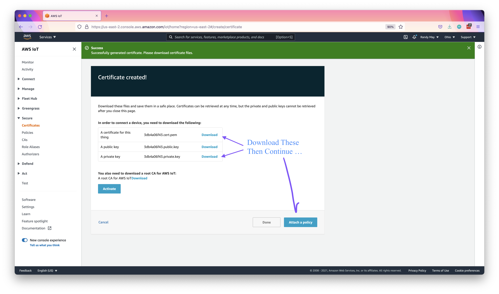

# Overview

This project is an end to end implementation of an IoT data acquisition and processing solution.  It is based primarily on AWS IoT and serverless offerings.  Audio data consisting of 40kHz audio samples is processed on a a Raspberry Pi, summarized using FFT and sent over MQTT to services in the cloud where the data is stored and visualized. 


The diagram below is an overview of the technical architecture.


In this project, the audio input is provided by a signal generation program. Connecting the Raspberry Pi to an actual microphone is an area for future work.  

# Guide to Contents

| Directory                              | Description                                                  |
| -------------------------------------- | ------------------------------------------------------------ |
| audio-domain                           | Java project containing "AudioSample" and other domain object definitions used by the Jet pipeline and the signal generator. |
| audio-processing-service-java          | These files are generated by grpc based on "audio_processor.proto."  They contain the classes needed by the Jet pipeline to call the audio processing service, which is written in Python. |
| audio-processing-service-python        | The Python based audio processing service.  The actual service code is in "audio_processor.py".  The remainder of the files are the grpc-generated service skeletons. |
| audio-visualization                    | A java project implementing an MQTT to Prometheus bridge.  It is deployed in AWS and listens for messages on MQTT.  When messages are received, they are exposed for collection by Promethues. |
| audio-visualization/aws-provisioner    | Automation used to provision an AWS instance and deploy the visualization components including: the MQTT-Prometheus bridge, Prometheus and Grafana. |
| jet-audio-monitor                      | The Hazelcast Jet pipeline responsible for processing events sent from the Raspberry Pi over MQTT. |
| simple-signal-generator                | This component runs on the Raspberry Pi and puts generated audio samples into the Jet processing pipeline. |
| audio_processor.proto                  | Defines the interface to the Python-based audio processing service. |
| generate-audio-processing-service-*.sh | Scripts to generate the language-specific stubs and skeletons for the audio processing service from the gRPC protocol definition. |


# Walk Through

### Prerequisites

Before starting this walk through, you will need the following:

- A Raspberry Pi device with internet connectivity.  The project was developed and tested with a Raspberry Pi 3b+ using Wi Fi within a home network.
- An AWS Account.  The storage and visualization functions are hosted in AWS and the project uses AWS IoT services for provisioning and management of the device as well as for transmitting data to the storage and visualization components.
- For the local machine, you must meet the following criteria:
  - be able to build maven projects (including the ability to download dependencies from the internet).
  - python3 is installed
  - Ansible is installed

### Install and Configure the AWS CLI on Your Local Machine

Various scripts will perform operations in your AWS account on your behalf using the CLI.  It needs to be on the path and configured with the proper credentials to access your account.  Both version 1 and version 2 of the CLI will work. See the following links for instructions.

https://docs.aws.amazon.com/cli/latest/userguide/cli-chap-install.html

https://docs.aws.amazon.com/cli/latest/userguide/cli-configure-quickstart.html#cli-configure-quickstart-config

### Raspberry Pi Setup

These steps assume the device is running a freshly installed copy of Raspberry Pi OS with ssh access.  However, In general, it should not be necessary to reinstall Raspberry Pi OS.  

For help setting up the Rasberry Pi with ssh access, see  [this article](https://www.tomshardware.com/reviews/raspberry-pi-headless-setup-how-to,6028.html) on the Tom's Hardware web site.

- [ ] Install a jdk on the device.  For example: `sudo apt install default-jdk-headless `
- [ ] Install "virtualenv" on the device: `sudo apt install virtualenv`
- [ ] Install "libatlas" and headers on the device `sudo apt install libatlas-base-dev`. This is necessary in order for numpy to be installed on device. 
- [ ] Navigate to the IoT section of the [AWS Console](https://console.aws.com/iot). On the left hand menu, select "Greengrass", "Core Devices" and click on "Set up one core device."


- [ ] On the next screen, enter "audiocap01" for the core device name and "audiocap" for the group name.  
- [ ] SSH to the Raspberry Pi as "pi" (or another user with sudo privilege) and follow the instructions shown under "Step 3".   Note that you have already done "Step 3.1: Install Java on the device".  


Note that this message can safely be ignored...

```bash
SLF4J: Failed to load class "org.slf4j.impl.StaticMDCBinder".
SLF4J: Defaulting to no-operation MDCAdapter implementation.
SLF4J: See http://www.slf4j.org/codes.html#no_static_mdc_binder for further details.
```


Your new device should show up in the "Core devices" list within about 2 minutes.

### Build the Java Projects

- [ ] Use Maven to build the Java projects as shown below.

```bash
cd audio-domain
mvn install
cd ../audio-processing-service-java
mvn install
cd ../audio-visualization
mvn package
cd ../jet-audio-monitor
mvn package
cd ../simple-signal-generator
mvn package
cd ..
```


### Configure the MQTT connection for the jet-audio-monitor component 

Review `jet-audio-monitor/greengrass_startup.sh` and note that it passes parameters to the jet-audio-monitor component.

```bash
#!/bin/bash
set -e
SCRIPTDIR=`dirname $0`
nohup java -cp  $SCRIPTDIR/target/jet-audio-monitor-1.0-SNAPSHOT.jar \
    -Dhazelcast.config=$SCRIPTDIR/hazelcast.yaml\
    com.sorintlab.jet.data.acquisition.audio.MonitoringJob \
    --audio-service-host localhost \
    --audio-service-port 9091 \
    --aws-mqtt-endpoint a17sav9lrv8l6k-ats.iot.us-east-2.amazonaws.com \
    --aws-mqtt-client-id jet \
    --aws-mqtt-topic audio_samples \
    --aws-client-cert-file /greengrass/v2/thingCert.crt \
    --aws-client-private-key-file /greengrass/v2/privKey.key \
    --output-topic audio_summaries  </dev/null >> /tmp/jet-audio-monitor.log 2>&1 &
echo $! > jet-audio-monitor.pid    
```

*Note that the `--aws-mqtt-endpoint` parameter is account and region specific.*  You will need to modify this for your own account and AWS region.

- [ ] Determine the correct endpoint using an AWS CLI command similar to the one shown below.

  ```bash
  $ aws iot describe-endpoint --endpoint-type iot:Data-ATS --region=us-east-1
  {
      "endpointAddress": "a17sav9lrv8l6k-ats.iot.us-east-1.amazonaws.com"
  }
  ```

- [ ] Modify `jet-audio-monitor/greengrass_startup.sh` to specify the correct endpoint for the `--aws-mqtt-endpoint` parameter.

### Package the Greengrass Components and Upload Them to S3

Greengrass components consist of a zip file on S3 containing artifacts and a recipe for using those artifacts.  In this step we are creating and uploading the artifacts.  We will also grant Greengrass core devices permission to access the s3 bucket containing the artifacts.

- [ ] Create an S3 bucket to hold the Greengrass component artifacts. The name must be globally unique. Something like `greengrass-components-999999999999-us-east-2` would be appropriate, with your AWS account number in the place of  `999999999999`.  
- [ ] Package and upload the components using the provided scripts as shown below.  Note that this step uses the AWS CLI to upload the components to S3.

```bash
export GG_S3_BUCKET=greengrass-components-999999999999-us-east-2
./jet-audio-monitor/gg_package.sh
./audio-processing-service-python/gg_pacakge.sh 
./simple-signal-generator/gg_package.sh
```

### Grant Greengrass Core Devices Permission to Download the Components from S3

- [ ] On the AWS Console, Navigate to the IAM Service and select "Policies" on the left side menu.  Click on "Create"

  

- [ ] On the next screen, select "Json" and add JSON similar to what is shown below.  Replace "GG_S3_BUCKET" with the name of the S3 bucket that was created above. Click Next.

  ```json
  {
    "Version": "2012-10-17",
    "Statement": [
      {
        "Effect": "Allow",
        "Action": [
          "s3:GetObject"
        ],
        "Resource": "arn:aws:s3:::GG-S3-BUCKET/*"
      }
    ]
  }
  ```

- [ ] You will be offered a chance to add tags.  Click Next.

- [ ] Fill out the name and description on the next screen.

  

  - [ ] Next, navigate to Roles and select the "GreengrassV2TokenExchangeRole"

    

  - [ ] Click on "Attach policies"

    

  - [ ] Find the newly created "Greengrass_Artifact_Reader" policy and attach it.

    

  

### Create the Greengrass Components

In the previous step we uploaded the artifacts, which are the code and configuration for our components.  In this step, we will upload *recipes*. A recipe associates a component name and version with the artifact bundle and also describes how to manage the components.  An example is shown below:

```yaml
---
RecipeFormatVersion: '2020-01-25'
ComponentName: com.sorintlab.audioprocessor.service
ComponentVersion: '1.0.1'
ComponentDescription: Audio Processor gRPC Service
ComponentPublisher: Sorint.lab US
ComponentConfiguration:
  DefaultConfiguration: {}
Manifests:
  - Platform:
      os: linux
    Lifecycle:
      Bootstrap: 
        Script: "bash {artifacts:decompressedPath}/audio_processor/greengrass_bootstrap.sh"
      Startup: 
        Script: "bash {artifacts:decompressedPath}/audio_processor/greengrass_startup.sh"
      Shutdown: 
        Script: "bash {artifacts:decompressedPath}/audio_processor/greengrass_shutdown.sh"
    Artifacts:
      - URI: s3://greengrass-components-999999999-us-east-2/com.sorintlab.audioprocessor.service/1.0.1/audio_processor.zip 
        Unarchive: ZIP
```

- [ ] To create a component, navigate to the Greengrass components page and click on "Create Component."


- [ ] Select "Enter Recipe as YAML" and cut and paste the YAML recipe,`audio-processing-service-python/com.sorintlab.audioprocessor.service.yaml`  into the dialog.  Change the string "GG_COMPONENT_BUCKET" to the name of the bucket you created and click "Create Deployment".  On the next screen you will see information about the newly created component.  Do not attempt to deploy the component yet.


- [ ] Repeat for all of the recipe files ...

```
audio-processing-service-python/com.sorintlab.audioprocessor.service.yaml 
jet-audio-monitor/com.sorintlab.jet.audio.monitor.yaml
simple-signal-generator/com.sorintlab.jet.audio.signal.emulator.healthy.yaml
simple-signal-generator/com.sorintlab.jet.audio.signal.emulator.unhealthy.yaml
```

You should now have 4 components listed in the Greegrass console.

### Deploy the Greengrass Components

Now we will deploy the components to the "audiocap" group.

- [ ] Select "Deployments" in the right side menu and click on "Deployment for audiocap."

  

- [ ] Currently, only the Greengrass CLI is deployed to this group.  Click on "Revise"

  

- [ ] Click through until you are given an option to add components to the deployment. Add the following components to the deployment: `com.sorintlab.audioprocessor.service`,`com.sorintlab.jet.audio.monitor`, `com.sorintlab.jet.audio.signal.emulator.healthy`.

  

  This will take approximately 5 minutes to deploy. You can follow the deployment by logging onto the Raspberry Pi and watching the greengrass log: `sudo tail -f /greengrass/v2/logs/greengrass.log`.  Also, you can watch the deployment by selecting the device from the "Core devices" list and clicking on the "Deployments" tab.   When it is done, it will look like the image below.

  

  Also, you can view the output from the audio processor component, which is written to `/tmp/jet-audio-monitor.log`. It should look similar to the sample below and it should be updated continuosly.

  ```bash
  20:56:58.425 [ INFO] [c.h.j.i.c.WriteLoggerP] [audio-monitor/loggerSink#0] Summary of 1 at t=1634241418352 rms volume: 10999
  	Spectrum Components
  	10999 @ 400Hz
  	10999 @ 600Hz
  
  20:56:58.466 [ INFO] [c.h.j.i.c.WriteLoggerP] [audio-monitor/loggerSink#0] Summary of 2 at t=1634241418398 rms volume: 9617
  	Spectrum Components
  	10999 @ 400Hz
  	7999 @ 800Hz
  ```

##### Troubleshooting Tips

- Start with the logs on the Raspberry Pi.  They are in  `/greengrass/v2/logs`
- If you need to force Greengrass to run the deployment again, you can select the deployment in the console, click on "Revise", then click through all of the pages without changing anything.  This will trigger a new deployment. Note that changes to the recipe will also trigger a new deployment.

### Verify  Messages are Being Sent to the MQTT topic

- [ ] In the AWS Console, navigate to "Test" on the left hand menu and subscribe to the "audio_summaries" topic.  You should start to see messages containing audio summaries.  Note that the messages are in a binary format so they will not display properly.

  


### Prepare Your AWS Account for Deployment of the Visualization Components

- [ ] In the ec2-console, create a new key pair named "audio-processor" and save the private key file to your local machine.

- [ ] You can either use your root user to provision the server or you can create another IAM user with more restricted access.  If you choose the latter, then grant the user the following privileges.

  ```json
      {
          "Version": "2012-10-17",
          "Statement": [
              {
                  "Action": [
                      "ec2:*",
                      "cloudformation:*",
                      "elasticloadbalancing:*"
                  ],
                  "Effect": "Allow",
                  "Resource": "*"
              }
          ]
      }
  ```

Detailed instructions for preparing your account can be found here: [AWS Setup](audio-visualization/aws-provisioner/AWS_Setup.docx). 

### Set up the Local Machine

- [ ] install gnu-tar (not just any tar!). On MacOS, that is `brew install gnu-tar`.
- [ ] install the Cloudalchemy Prometheus Ansible role: `ansible-galaxy install cloudalchemy.prometheus`

- [ ] install the "jinja2" and "boto3" packages for python3 - you can either install the packages directly or you can insall them in a virtual environment. The second option is shown below.

  ```bash
  cd audio-visualization/aws-provisioner
  virtualenv -p /usr/bin/python3 venv
  . venv/bin/activate
  pip install boto3 jinja2
  ```

  

### Provision the Cloud Server for the Visualization Component and Deploy It

These steps are performed on the local machine, not the Raspberry Pi.  The AWS provisioning system is a modified version of this open source project: https://github.com/wrmay/gem-ops-suite.  It provisions a single t3.micro ec2-instance in its own VPC and writes out an Ansible inventory file: `inventory.ini`.  The Ansible playbook, `install.yaml` can then be used to install Prometheus, Grafana and the MQTT-Prometheus bridge.

- [ ] Figure out the ami id of the 64-bit x86, Amazon Linux HVM ami in the region where you want to launch your instance.  The best way to do this is using the "Lauch instances" functionality of the ec2 console as shown below.  Note: you do not need to actually launch an instance.

- [ ] 

  

- [ ] edit `audio-visualization/aws-provisioner/config/awscluster.json` , make sure that the "SSHKeyPairName" and "SSHKeyPath" are correct.  Change the "RegionName" setting to the name of the AWS region where you want to deploy the audio visualizer and change the "ImageId" to the ami identifier from the previous step.  See the example below:

  ```json
  {
    "EnvironmentName" : "AudioProcessor",
    "RegionName" : "us-east-2",
    "SSHKeyPairName" : "audio-processor",
    "SSHKeyPath": "audio-processor.pem",
    "Servers" : [
      {
        "Name" : "audiovisualization",
          "PrivateIP" : "192.168.1.101",
          "AZ" : "A",
          "InstanceType" : "t3.micro",
          "Roles" : [],
         	"ImageId" : "ami-00dfe2c7ce89a450b"
      }
    ]
  }
  ```

- [ ] Generate the definition and provision the server.

  ```bash
  cd audio-visualization/aws-provisioner
  python3 generateAWSCluster.py
  ```

  This will create a cloud formation template: `config/cloudformation.json`

- [ ] Provision the cloud infrastructure: `python3 aws_provision.py`.  This will use cloud formation to provison the resources. An ansible inventory file will be written to `inventory.ini`. You should now be able to see the ec2 instance in the aws console as well as the cloud formation template.

**Troubleshootint Tips**

- If the last step fails, try running `python3 aws_provision.json` again.  


### Create a Certificate to Enable the Visualization Layer to Consume MQTT Messages

- [ ] Navigate to "Certificates" in the AWS IoT Service console and click "Create"


- [ ] Choose "One-click certificate creation"


- [ ] Download the certificate and private key and then click "Attach a policy"



- [ ] Attach the GreengrassV2IoTThingPolicy


- [ ] Activate the certificate


### Install Grafana, Prometheus and the MQTT Prometheus Bridge

- [ ] Edit `audio-visualization/aws-provisioner/launch.sh`.  Set the "--aws-mqtt-endpoint" to the same value used in the "Configure the MQTT connection for the jet-audio-monitor component" section above.

- [ ] Save the private key file and cert from the previous step into the `audio-visualization/aws-provisioner/auth` folder.  Edit the launch script to specify the correct name for both files.

  ``` bash
  nohup java -cp audio-mqtt-prometheus-bridge-1.0-SNAPSHOT.jar com.sorintlab.jet.data.acquisition.audio.MQTTPrometheusBridge \
  	--aws-mqtt-endpoint >>> a17sav9lrv8l6k-ats.iot.us-east-2.amazonaws.com <<< \
  	--aws-mqtt-client-id prometheus \
  	--aws-mqtt-topic audio_summaries \
  	--aws-client-cert-file >>> 3db4a06f43-certificate.pem.crt <<< \
          --aws-client-private-key-file >>> 3db4a06f43-private.pem.key <<<	< /dev/null  \
  				> /tmp/mqtt-promethus.log 2>&1 &
  
  ```

   

- [ ] Run the install Ansible playbook to install all of the visualization components.

  ```bash
  # set this environment variable on recent-model Macs
  export OBJC_DISABLE_INITIALIZE_FORK_SAFETY=YES
  
  ansible-playbook -i inventory.ini --key-file audio-processor.pem install.yaml
  ```

  

### Set up Grafana 

The file `inventory.ini` contains the public IP addres of the audio visualization server.  Grafana is running on port 3000 on that server. Use  a browser to access port 3000 on that server and follow the instructions below.


If everything is working, you should see something like the image below.


### Update the Signal Generator

Now we can change the signal generator and see the changes reflected in the resulting graphs. 

To do this, simply revise the "for audiocap" deployment in the IoT console.  Remove the healthy signal generator and add the unhealthy signal generator.

After a while, you should see a new line appear on the graph for source 2.


### Clean Up

To clean up the AWS resources related to the audio visualization, you can either undeploy the CloudFormation template or use the "aws_destroy.py" script.

```bash
cd audio_visualization/aws-provisioner
python3 aws_destroy.py 
```


To stop the audio-processor from running on your Raspberry Pi, you can simply revise  the deployment and remove the components.


This concludes the walk-through.


# Developer Information


### Regenerating the gRPC stubs and skeletons for Python

For python you will need the grpc tools package.  The best way to do this is to set up a virtual environment and then use the "requirements.txt" file in "audio-processing-service-python" to install the needed packages.  For example:

```
virtualenv -p  -p /usr/local/Cellar/python\@3.9/3.9.5/bin/python3 venv
. venv/bin/activate
pip install -r audio-processing-service-python/requirements.txt
```

Once you have the tools installed, run `generate-audio-processing-service-python.sh` to regenerate the stubs and skeletons.  This will overwwrite the previously generated files but it will not harm "audio_processor.py".


### Regenerating gRPC stubs and skeletons for Java

Install the protobuf compiler from here: https://github.com/protocolbuffers/protobuf/releases.  
Do not get the language specific package, get the platform specific package, for example, 
https://github.com/protocolbuffers/protobuf/releases/download/v3.17.3/protoc-3.17.3-osx-x86_64.zip.  
Execute it once while holding down the "Option" key so you can tell MacOs to trust it.

Obtain the grpc java plugin to the protoc compiler here: 
https://repo1.maven.org/maven2/io/grpc/protoc-gen-grpc-java/1.38.1/ .  Rename the download to 
`protoc-gen-grpc-java` make it executable, _and put it in the same directory as protoc_.  
Execute it once while holding down the "Option" key so you can tell MacOs to trust it.

Edit `generate-audio-processing-service-java.sh` and set PROTOC_PATH to the directory that 
contains `protoc` and `protoc-gen-grpc-java`. You can now generate the java components of 
the audio processing service by running the script: `generate-audio-processing-service-java.sh`

# References

Greengrass getting started guide: https://docs.aws.amazon.com/greengrass/v2/developerguide/getting-started.html

Hazelcast Jet Documentation: https://jet-start.sh/docs/get-started/intro


